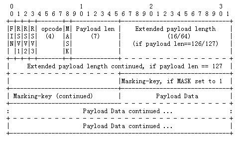

# Websocket协议

## Data Framing

Websocket协议通过序列化的数据帧传输数据。数据封包协议中定义了`opcode`、`payload length`、`Payload data`等字段。其中要求：

- 客户端向服务器传输的数据帧 **必须进行掩码处理**: 服务器若接收到未经过掩码处理的数据帧，则必须主动关闭连接。
- 服务器向客户端传输的数据帧 **一定不能进行掩码处理**: 客户端若接收到经过掩码处理的数据帧，则必须主动关闭连接。

针对上情况，发现错误的一方可向对方发送close帧（状态码是1002，表示协议错误），以关闭连接。

详细说明：

### FIN

标识是否为此消息的最后一个数据包，占 `1 bit`

> RSV1, RSV2, RSV3: 用于扩展协议，一般为0，各占`1bit`

### Opcode

数据包类型（frame type），占`4bits`
- `0x0`：标识一个中间数据包
- `0x1`：标识一个text类型数据包
- `0x2`：标识一个binary类型数据包
- `0x3-7`：保留
- `0x8`：标识一个断开连接类型数据包
- `0x9`：标识一个ping类型数据包
- `0xA`：表示一个pong类型数据包
- `0xB-F`：保留

### MASK
占`1bits`, 用于标识PayloadData是否经过掩码处理。如果是`1`，`Masking-key` 域的数据即是掩码密钥，用于解码`PayloadData`。客户端发出的数据帧需要进行掩码处理，所以此位是`1`。

### Payload length

Payload data的长度，占`7bits`，`7+16bits`，`7+64bits`：

- 如果其值在0-125，则是payload的真实长度。
- 如果值是126，则后面2个字节形成的`16bits`无符号整型数的值是payload的真实长度。注意，网络字节序，需要转换。
- 如果值是127，则后面8个字节形成的`64bits`无符号整型数的值是payload的真实长度。注意，网络字节序，需要转换。

这里的长度表示遵循一个原则，用最少的字节表示长度（尽量减少不必要的传输）。

举例说，payload真实长度是124，在0-125之间，必须用前7位表示；不允许长度1是126或127，然后长度2是124，这样违反原则。

### Payload data

应用层数据, server解析client端的数据

接收到客户端数据后的解析规则如下：

#### 1byte
- `1bit`: frame-fin，x0表示该message后续还有frame；x1表示是message的最后一个frame
- `3bit`: 分别是frame-rsv1、frame-rsv2和frame-rsv3，通常都是x0
- `4bit`: frame-opcode，x0表示是延续frame；x1表示文本frame；x2表示二进制frame；x3-7保留给非控制frame；x8表示关 闭连接；x9表示ping；xA表示pong；xB-F保留给控制frame

#### 2byte

- `1bit`: Mask，1表示该frame包含掩码；0表示无掩码
- `7bit`、`7bit+2byte`、`7bit+8byte`: 
    - 7bit取整数值，若在0-125之间，则是负载数据长度；
    - 若是126表示，后两个byte取无符号16位整数值，是负载长度；
    - 127表示后8个 byte，取64位无符号整数值，是负载长度
- `3-6byte`: 这里假定负载长度在0-125之间，并且Mask为1，则这4个byte是掩码
- `7-end byte`: 长度是上面取出的负载长度，包括扩展数据和应用数据两部分，通常没有扩展数据；
若Mask为1，则此数据需要解码，解码规则为 - `1-4byte`掩码循环和数据byte做 **异或操作**。
